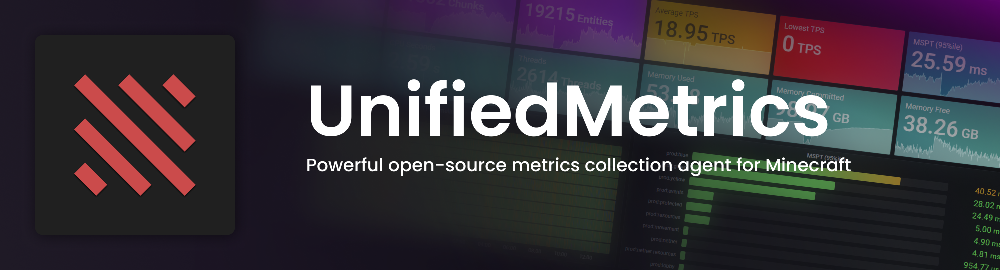

[](COPYING.LESSER)
[](https://github.com/Cubxity/UnifiedMetrics/issues)
[](https://github.com/Cubxity/UnifiedMetrics/actions)
[](https://discord.gg/kDDhqJmPpA)

UnifiedMetrics is a fully-featured free and open-source metrics collection plugin for Minecraft servers. This project is
licensed under [GNU LGPLv3](COPYING.LESSER).


<p align="center">
    <a href="https://snapshot.raintank.io/dashboard/snapshot/i0Btqtz01e4DkmW3N89y61wc5tIMJZKm">
        Click here for preview!
    </a>
</p>

## Features

- **Platform-agnostic & compatible with popular platforms**. Get the same metrics and features on any supported platform
- **Monitor your server in real-time** with Prometheus/InfluxDB and provided Grafana dashboards.
- **High performance** metric collection. Low to none performance impact on the server's performance.
- **Free and open-source**. The code is free and open for anyone to audit and contribute to.

## Compatibility

**Server:**

- 1.8+ Spigot servers *(includes Spigot-based forks)*
- Minestom
- Velocity
- BungeeCord

**Metrics:**

- Prometheus
- InfluxDB

## Metrics

| Collector     | Description                                     | Platform            | Default |
| ------------- | ----------------------------------------------- | ------------------- | ------- |
| systemGc      | Garbage collection duration and freed bytes     | All                 | true    |
| systemMemory  | Memory used, committed, max and init            | All                 | true    |
| systemProcess | CPU load, seconds, and process start time       | All                 | true    |
| systemThread  | Current, daemon, started, and peak thread count | All                 | true    |
| events        | Login, join, quit, chat, and ping event counter | All                 | true    |
| server        | Plugins count and player counts                 | All                 | true    |
| tick          | Tick duration histogram                         | Bukkit, Minestom    | true    |
| world         | World entities, players, and chunks count       | Bukkit, Minestom    | true    |

## Getting started

Read the [wiki](https://github.com/Cubxity/UnifiedMetrics/wiki) for instructions.

## Data visualization and analysis

We recommend using [Grafana](https://grafana.com/) as it provides highly customizable diagrams. Grafana provides
out-of-box support for Prometheus and InfluxDB.

See the [wiki](https://github.com/Cubxity/UnifiedMetrics/wiki/Grafana) for detailed instructions.

> **Note:** InfluxDB Grafana dashboard may be inaccurate due to complications with Flux queries.

### UnifiedMetrics 0.3.x (stable)

- [InfluxDB (Flux)](https://grafana.com/grafana/dashboards/14755)
- [Prometheus](https://grafana.com/grafana/dashboards/14756)

### UnifiedMetrics 0.2.x (legacy)

- [InfluxDB (InfluxQL)](https://grafana.com/grafana/dashboards/13860)
- [Prometheus](https://grafana.com/grafana/dashboards/14017)

## Building from source

**Requirements:**

- JDK 11+
- Git (Optional)

To build UnifiedMetrics, you need to obtain the source code first. You can download the source from GitHub or use the
Git CLI.

```bash
$ git clone https://github.com/Cubxity/UnifiedMetrics && cd UnifiedMetrics
```

Open a terminal in the cloned directory and run the following command. The following command will build all subprojects.

```bash
$ ./gradlew shadowJar
```

To build a specific subproject, you can prefix it with the subproject path. For example:

```bash
$ `./gradlew :unifiedmetrics-platform-bukkit:shadowJar`
```

The output artifacts can be found in `subproject/build/libs`.

## API

Add `:unifiedmetrics-api` as a dependency (compileOnly/provided).

```kotlin
import dev.cubxity.plugins.metrics.api.UnifiedMetricsProvider

/* ... */

val api = UnifiedMetricsProvider.get()
```

## Servers using UnifiedMetrics

<p float="left">
  <a href="https://craftadia.com">
    
  </a>
  <a href="https://octanemc.net">
    
  </a>
</p>

> **Pssst!** You can add your server here by submitting a *Pull Request*!
