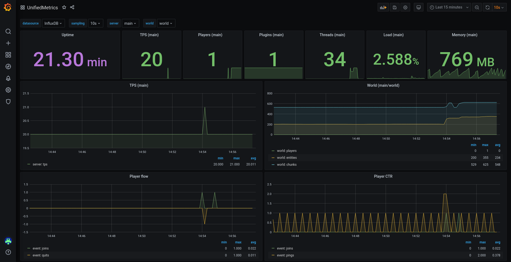

[](COPYING.LESSER)
[](https://github.com/Cubxity/UnifiedMetrics/actions)
[](https://search.maven.org/search?q=g:dev.cubxity.plugins%20a:unifiedmetrics-api)
[](https://discord.gg/kDDhqJmPpA)

UnifiedMetrics is a fully-featured free and open-source metrics collection plugin for Minecraft servers. This project is
licensed under [GNU LGPLv3](COPYING.LESSER).

[](https://unifiedmetrics-demo.cubxity.dev)
*Dashboard [included](https://github.com/Cubxity/UnifiedMetrics/wiki/Grafana) out-of-box!*
Click [here](https://unifiedmetrics-demo.cubxity.dev) for live preview!

## Features

- **Platform-agnostic & compatible with popular platforms**. Get the same metrics and features on any supported
  platform.
- **Monitor your server in real-time** with Prometheus/InfluxDB and provided Grafana dashboards.
- **High performance** metric collection. Low to none performance impact on the server's performance.
- **Free and open-source**. The code is free and open for anyone to audit and contribute to.

## Compatibility

**Server:**

- 1.8+ Spigot servers *(includes Spigot-based forks)*
- 1.16+ Fabric servers
- Minestom
- Velocity
- BungeeCord

**Metrics:**

- Prometheus
- InfluxDB

## Getting started

Read the [wiki](https://github.com/Cubxity/UnifiedMetrics/wiki) for instructions on how to get started.

## Metrics

<details> 
  <summary>Table of metrics (click to show)</summary>

| Collector     | Description                                     | Platform         | Default |
|---------------|-------------------------------------------------|------------------|---------|
| systemGc      | Garbage collection duration and freed bytes     | All              | true    |
| systemMemory  | Memory used, committed, max and init            | All              | true    |
| systemProcess | CPU load, seconds, and process start time       | All              | true    |
| systemThread  | Current, daemon, started, and peak thread count | All              | true    |
| events        | Login, join, quit, chat, and ping event counter | All              | true    |
| server        | Plugins count and player counts                 | All              | true    |
| tick          | Tick duration histogram                         | Bukkit, Minestom | true    |
| world         | World entities, players, and chunks count       | Bukkit, Minestom | true    |

</details>

## Special Thanks

[Bloom Host](https://billing.bloom.host/aff.php?aff=9) has kindly provided UnifiedMetrics with development servers.
Bloom has server splitting built-in, which makes it extremely easy to build your monitoring stack. Get high performance
servers at Bloom by using [this link](https://billing.bloom.host/aff.php?aff=9).

[](https://billing.bloom.host/aff.php?aff=9)

YourKit supports open source projects with innovative and intelligent tools for monitoring and profiling Java and .NET
applications. YourKit is the creator of [YourKit Java Profiler](https://www.yourkit.com/java/profiler/),
[YourKit .NET Profiler](https://www.yourkit.com/.net/profiler/),
and [YourKit YouMonitor](https://www.yourkit.com/youmonitor/).

[](https://www.yourkit.com/)

## Building from source

<details> 
  <summary>Instructions (click to show)</summary>

**Requirements:**

- JDK 8+ (16+ for Fabric, 17+ for Minestom)
- Git (Optional)

To build UnifiedMetrics, you need to obtain the source code first. You can download the source from GitHub or use the
Git CLI.

```bash
$ git clone https://github.com/Cubxity/UnifiedMetrics && cd UnifiedMetrics
```

Open a terminal in the cloned directory and run the following command. The following command will build all subprojects.

```bash
$ ./gradlew assemble -x signArchives
```

> `-x signArchives` is required to skip signing, unless you have signing set up

To build a specific subproject, you can prefix it with the subproject path. For example:

```bash
$ ./gradlew :unifiedmetrics-platform-bukkit:assemble -x signArchives
```

The output artifacts can be found in `subproject/build/libs`.
</details>

## API

[](https://search.maven.org/search?q=g:dev.cubxity.plugins%20a:unifiedmetrics-api)


<details> 
  <summary>Instructions (click to show)</summary>

### Examples

Example plugins can be found under [examples](examples) directory.

### Gradle (Kotlin)

```kotlin
repositories {
    mavenCentral()

    // Snapshots repository (only required for -SNAPSHOT versions)
    maven("https://s01.oss.sonatype.org/content/repositories/snapshots/")
}
```

```kotlin
dependencies {
    // Replace this with the desired version
    compileOnly("dev.cubxity.plugins", "unifiedmetrics-api", "0.3.6")
}
```

### Usage

Add `:unifiedmetrics-api` as a dependency (compileOnly/provided). Prefer using platform's service manager if possible.

```kotlin
import dev.cubxity.plugins.metrics.api.UnifiedMetricsProvider

/* ... */

val api = UnifiedMetricsProvider.get()
```

</details>
